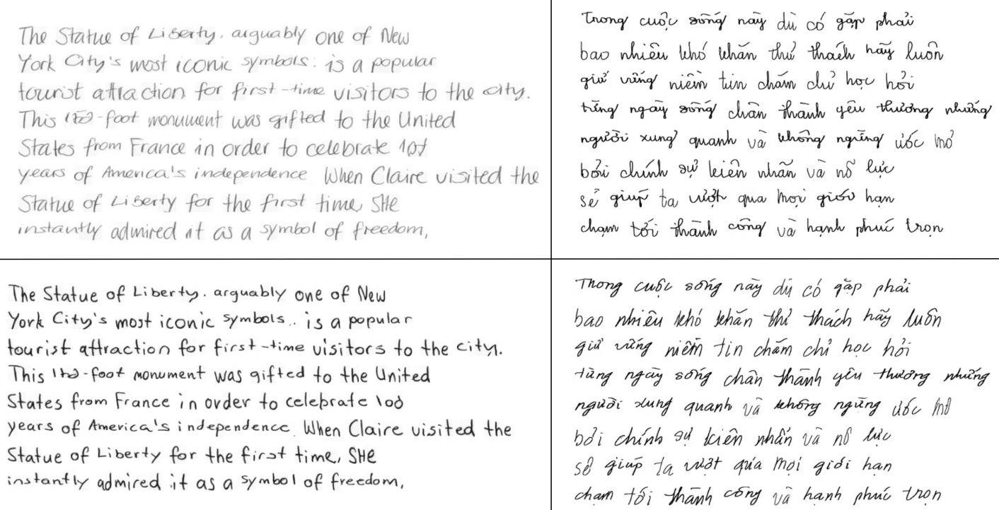
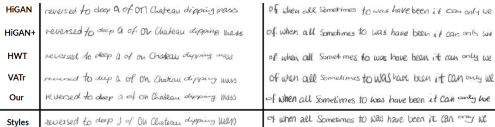

# WriteViT

<p align="center"><em>Handwritten Text Generation with Vision Transformers</em></p>

<p align="center">
  <a href="https://arxiv.org/abs/2505.13235"></a>
  <a href="https://doi.org/10.1016/j.eswa.2026.133742"></a>
  <a href="https://colab.research.google.com/drive/15Lswqr-aQwI-fF6yRoGYt-2pxSlC2L-R"></a>
  <a href="https://huggingface.co/DAIR-Group/WriteViT"></a>
  <a href="LICENSE"></a>
</p>

<p align="center">
  <a href="https://orcid.org/0009-0009-2539-8282">Dang Hoai Nam</a> &middot;
  <a href="https://orcid.org/0009-0001-9187-4824">Huynh Tong Dang Khoa</a> &middot;
  <a href="https://orcid.org/0000-0002-9811-0093">Vo Nguyen Le Duy</a>
  <br>
  <em>Expert Systems with Applications</em>, Volume 332 (2027), Article 133742
</p>

This repository contains the official PyTorch implementation of WriteViT, a one-shot framework that learns a writer's style from reference handwriting and synthesizes new text in that style.

## Abstract

Inferring a writer's style from a single reference image is difficult because a synthesis model must separate textual content from subtle spatial and stylistic cues. WriteViT addresses this challenge with a transformer-driven framework for one-shot handwritten word synthesis. It combines a ViT-based Writer Identifier for style extraction, a lightweight ViT recognizer for content supervision, and a hierarchical multi-scale Transformer generator with conditional positional encoding for progressive refinement from global layout to fine stroke details. Experiments reported in the paper on IAM, CVL, and HANDS-VNOnDB demonstrate style-consistent generation across English, German, and Vietnamese, including low-resource settings. The results support Transformer-based modeling as a promising direction for multilingual handwriting synthesis and data augmentation, particularly for languages with complex diacritics.

**Keywords:** Handwritten Text Synthesis · Vision Transformer · One-shot Learning · Vietnamese Handwriting · Multi-scale Generation · Generative Adversarial Networks

## Method overview

<p align="center">
  
</p>

The Writer Identifier encodes writer-specific style, the recognizer supplies textual supervision during training, and the generator combines style and target-character representations at multiple spatial scales to produce the final word image.

## Resources

- [Published paper — *Expert Systems with Applications*](https://doi.org/10.1016/j.eswa.2026.133742)
- [arXiv preprint](https://arxiv.org/abs/2505.13235)
- [Interactive demo](https://colab.research.google.com/drive/15Lswqr-aQwI-fF6yRoGYt-2pxSlC2L-R)
- [Hugging Face release: model, datasets, checkpoints, and code](https://huggingface.co/DAIR-Group/WriteViT)
- [Google Drive mirror: datasets and checkpoints](https://drive.google.com/drive/folders/1ZgYS6-6l6fjKY75RJipONBByujIgf-uE?usp=sharing)

## Installation

Python 3.7 or newer and a CUDA-capable GPU are recommended for training.

```bash
git clone https://github.com/hnam-1765/WriteViT.git
cd WriteViT

python -m venv .venv
source .venv/bin/activate
python -m pip install --upgrade pip
python -m pip install -r requirements.txt
```

Install the PyTorch build appropriate for your CUDA version if the default package does not match your system. See the [PyTorch installation guide](https://pytorch.org/get-started/locally/).

## Data and checkpoints

The prepared datasets and released checkpoints are available on Hugging Face:

```bash
git lfs install
git clone https://huggingface.co/DAIR-Group/WriteViT
cd WriteViT
```

If you only need the artifacts for this GitHub codebase, download the Hugging Face release or the Google Drive mirror and place the files under `File/`. The default IAM configuration expects:

```text
File/
├── IAM.pickle
├── VN.pickle
├── eng_ckpt.pth
├── vn_ckpt.pth
├── vgg19.pth
├── english_words.txt
├── vn_words.txt
└── unifont.pickle
```

Released artifact summary:

| File | Description |
| --- | --- |
| `File/eng_ckpt.pth` | English/IAM checkpoint |
| `File/vn_ckpt.pth` | Vietnamese checkpoint |
| `File/vgg19.pth` | VGG19 backbone checkpoint/resource |
| `File/IAM.pickle` | Prepared IAM dataset pickle |
| `File/VN.pickle` | Prepared Vietnamese dataset pickle |
| `File/unifont.pickle` | Font/template data used for query rendering |
| `File/english_words.txt` | English lexicon |
| `File/vn_words.txt` | Vietnamese lexicon |

The prepared dataset is a dictionary split by writer:

```python
{
    "train": {
        "writer_id": [
            {"img": PIL.Image.Image, "label": "handwritten text"},
            # ...
        ]
    },
    "test": {
        "writer_id": [
            {"img": PIL.Image.Image, "label": "handwritten text"},
            # ...
        ]
    },
}
```

To use another dataset or language, update `DATASET`, `DATASET_PATHS`, `NUM_WRITERS`, `WORDS_PATH`, and `ALPHABET` in `params.py`. More information about the auxiliary files is available in [`File/README.md`](File/README.md).

## Training

Review the experiment settings in `params.py`, especially the dataset paths, batch size, backbone, learning rates, and resume flag. Then start training with:

```bash
CUDA_VISIBLE_DEVICES=0 python train.py
```

The device is selected automatically by PyTorch. Checkpoints are written to `saved_models/<EXP_NAME>/`. The training setup also prepares `saved_images/<EXP_NAME>/` for generated samples and evaluation artifacts.

The available recognizer backbones are `resnet18`, `vgg11`, and `vgg19`.

## Results

### Handwriting generation

<p align="center">
  
</p>

### Handwriting reconstruction

<p align="center">
  
</p>

## Repository structure

```text
WriteViT/
├── LICENSE         # MIT license
├── data/           # Dataset loading and preparation utilities
├── Figures/        # Architecture and qualitative results
├── File/           # Lexicons, Unifont data, and prepared datasets
├── models/         # Generator, discriminators, recognizer, and writer encoder
├── requirements.txt # Python dependencies
├── util/           # Shared model and training utilities
├── params.py       # Experiment and dataset configuration
└── train.py        # Training entry point
```

## Citation

If you use WriteViT in your research, please cite:

```bibtex
@article{nam2026writevit,
  title={WriteViT: Handwritten Text Generation with Vision Transformer},
  author={Nam, Dang Hoai and Khoa, Huynh Tong Dang and Le Duy, Vo Nguyen},
  journal={Expert Systems with Applications},
  pages={133742},
  year={2026},
  publisher={Elsevier}
}
```

## Acknowledgements

This repository builds on [Handwriting Transformers](https://github.com/ankanbhunia/Handwriting-Transformers) by Ankan Kumar Bhunia et al. We thank the authors for making their work publicly available.

## License

This project is released under the [MIT License](LICENSE).
